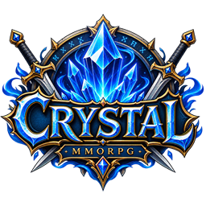

<h1>
  
  Crystal Ot Client - Redemption
</h1>

[](https://discord.gg/WpBGsRNC7D)
[](https://crystalgames.com.br/)
[](https://opensource.org/licenses/MIT)

---

## <a id="table-of-contents"></a>📋 Sumário

1.   [O que é o Crystal Client?](#what-is-otclient)
2. 🚀 [Recursos](#features)
3.  [Projeto para dispositivos móveis](#the-mobile-project)
4. 🔨 [Compilação](#compiling)
5. 🐳 [Docker](#docker)
6. 🩺 [Precisa de ajuda?](#need-help)
7. 📑 [Problemas e correções](#bugs)
8. ❤️ [Planejamento](#roadmap)
9. 💯 [Protocolos compatíveis](#support-protocol)
10. ©️ [Licença](#license)
11. ❤️ [Colaboradores](#contributors)
12. 📦 [Instalação automática dos arquivos do jogo](docs/client-assets-auto-install.md)
13. ⬆️ [Atualização por ZIP](docs/UPDATER-ZIP.md)

---

## <a id="what-is-otclient"></a> O que é o Crystal Client?

O **Crystal Client** é o cliente da [Crystal Games](https://crystalgames.com.br/), baseado no OTClient Redemption. O OTClient é uma alternativa ao cliente de Tibia para servidores OTServ, com foco em uma interface **completa** e **flexível**:

- **Scripts Lua** para as funcionalidades da interface do jogo
- **Sintaxe semelhante a CSS** para definir a interface
- **Sistema modular**: cada funcionalidade possui seu próprio módulo, facilitando a personalização
- Possibilidade de criar mods e ampliar a interface
- Desenvolvido em **C++** e **Lua**; esta base usa C++20 no Windows e C++23 nas demais compilações nativas

Para jogar, acesse o [site da Crystal Games](https://crystalgames.com.br/) para obter o cliente. A configuração desta edição utiliza **Canary**; a base OTClient também possui integrações com **The Forgotten Server**.

> [!NOTE]
> Baseado em [edubart/otclient](https://github.com/edubart/otclient) • Revisão: [2.760](https://github.com/edubart/otclient/commit/fc39ee4adba8e780a2820bfda66fc942d74cedf4)

---

## <a id="features"></a>🚀 Recursos

Além da flexibilidade dos scripts, a base oferece **sistema de som**, **efeitos gráficos com shaders**, **módulos e complementos**, **texturas animadas**, **interface personalizável**, **transparência**, **suporte a idiomas**, **terminal Lua integrado** e um motor **OpenGL ES 2.0** que permite a adaptação para dispositivos móveis. Também pode servir de base para ferramentas, como editores de mapas: o OTClient reúne um **framework e APIs de Tibia**.

### ⚡ Desempenho e motor gráfico

<details>
  <summary>🖼️ Renderização (demonstração de otimização)</summary>

  https://github.com/user-attachments/assets/fe5f1d7f-7195-4d65-bca6-c2b5d62d3890
</details>

<details>
  <summary>📦 Carregamento assíncrono de texturas</summary>

- **Descrição:** o arquivo SPR não fica integralmente em cache, reduzindo o consumo de memória RAM.
- **Vídeo:**

  https://github.com/kokekanon/otclient.readme/assets/114332266/f3b7916a-d6ed-46f5-b516-30421de4616d
</details>

<details>
  <summary>🧵 Processamento com múltiplas threads</summary>

**Thread principal**

- Som
- Partículas
- Carregamento de texturas a partir de arquivos
- Eventos da janela (teclado, mouse etc.)
- Desenho de texturas

**Thread 2 — conexão e mapa**

- Conexão
- Eventos (`g_dispatcher`)
- Coleta de informações para desenhar o mapa

**Thread 3 — interface**

- Coleta de informações para desenhar a interface

**Imagem:**  

</details>

<details>
  <summary>🧹 Coleta de lixo e gerenciamento de memória</summary>

**Descrição (1):**
```
A coleta de lixo gerencia a memória automaticamente, identificando e liberando objetos que não estão mais em uso. Isso evita o acúmulo desnecessário de dados e contribui para a estabilidade do cliente.
```

**Descrição (2):**  
O coletor identifica o que deixou de ser utilizado e libera a memória correspondente. Isso inclui objetos Lua, texturas, drawpool e thingtype.
</details>

<details>
  <summary>🧭 Sistema de atlas de texturas</summary>

*(recurso voltado à melhoria do motor gráfico e à redução das chamadas de desenho)*
</details>

- Compilação em x86 e x64, com Visual Studio 2022 no Windows e dependências definidas pelo manifesto `vcpkg.json`  
- Melhorias no sistema de movimentação  
- Suporte a pacotes sequenciados e compressão  
- Carregamento de assets (Tibia 13)

---

### 🎛️ Interface e experiência do usuário

<details>
  <summary>🧩 Melhorias nos UIWidgets</summary>

- **Descrição:** melhorias nos algoritmos da interface ao adicionar, remover e reposicionar widgets, perceptíveis no **módulo de batalha**.
- **Vídeo:**  

  https://github.com/user-attachments/assets/35c79819-b78b-4578-a4a2-af1235139807
</details>

<details>
  <summary>🔁 Recarregamento automático de módulos</summary>

Ativação: `g_modules.enableAutoReload()` ([init.lua](init.lua))  
Vídeo:  

https://github.com/kokekanon/otclient.readme/assets/114332266/0c382d93-6217-4efa-8f22-b51844801df4
</details>

<details>
  <summary>✨ Sistema de efeitos anexados (auras, asas…)</summary>

- Compatível com **APNG**
  - ThingCategoryEffect
  - ThingCategoryCreature
  - ThingExternalTexture: imagens em **PNG ou APNG**

- **Documentação e suporte:** https://discord.gg/WpBGsRNC7D
- **Exemplo de código:** [effects.lua](modules/game_attachedeffects/effects.lua) • [código de teste](modules/game_attachedeffects/attachedeffects.lua)  
- **Configurações específicas por lookType:** [outfit_618.lua](modules/game_attachedeffects/configs/outfit_618.lua)

> [!TIP]
> Use **ThingConfig** para ajustar os deslocamentos por lookType quando o alinhamento padrão não for adequado ao sprite.

<p align="center">
<table>
<tr>
<td></td>
<td></td>
<td></td>
</tr>
<tr>
<td align="center">Efeito anexado a ThingCategory</td>
<td align="center">Efeito anexado com textura PNG</td>
<td align="center">Partícula</td>
</tr>
</table>
</p>
</details>
<details>
  <summary>🧭 Sistema de controle de módulos</summary>

Uma forma de organizar módulos com o gerenciamento de atalhos, conexões de eventos e widgets pelo controlador.  
**Exemplo:** ([modules/game_minimap/minimap.lua](modules/game_minimap/minimap.lua))
</details>

<details>
  <summary>🖼️ Opções de suavização de bordas</summary>

- **Observação:** o modo **Smooth Retro** pode aumentar o uso da GPU.

**GIF:**  

</details>

<details>
  <summary>🧩 Informações de criaturas com UIWidget</summary>

- Ativação: [setup.otml](data/setup.otml)
- Estilo: [modules/game_creatureinformation](modules/game_creatureinformation)
- **Observação da base original:** o uso de UIWidgets pode reduzir o desempenho em relação ao desenho direto pelo Draw Pool. A documentação original relatava uma diferença de aproximadamente 20% em um teste com 60 monstros.

**Vídeo:**  

https://github.com/kokekanon/otclient.readme/assets/114332266/c2567f3f-136e-4e11-964f-3ade89c0056b
</details>

<details>
  <summary>🧱 Widget em pisos do mapa</summary>

Documentação e suporte: https://discord.gg/WpBGsRNC7D

<p align="center">
<table>
<tr>
<td></td>
<td></td>
<td></td>
</tr>
<tr>
<td align="center">Efeito anexado ao piso</td>
<td align="center">Widget no piso</td>
<td align="center">Partícula no piso</td>
</tr>
</table>
</p>
</details>

<details>
  <summary>🧩 Suporte à sintaxe HTML/CSS</summary>

https://github.com/user-attachments/assets/b16359d3-09a4-4181-bcb8-c76339b64b37

https://github.com/user-attachments/assets/d3844223-7e35-45da-a872-3141f1c5860a

https://github.com/user-attachments/assets/9f20814f-0aed-4b70-8852-334ac745ec11  

https://github.com/user-attachments/assets/3ac8473c-8e90-4639-b815-ef183c7e2adf

**Exemplos de módulos:**  
- [Shader](modules/game_shaders)  
- [Bênçãos](modules/game_blessing/)
</details>

<details>
  <summary>🎥 Câmera adaptada à latência</summary>

A câmera se adapta à latência do servidor para suavizar a movimentação. Com ping mais alto, acompanha o tempo de resposta do servidor; com ping menor, responde mais rapidamente. O comportamento também depende da velocidade do personagem.
</details>

<details>
  <summary>🧭 Suporte a deslocamento negativo (.dat)</summary>

- Compatível com [ObjectBuilderV0.5.5](https://github.com/punkice3407/ObjectBuilder/releases/tag/v0.5.5)  
- Ativação: `g_game.enableFeature(GameNegativeOffset)`

**Vídeo:**  

https://github.com/kokekanon/otclient.readme/assets/114332266/16aaa78b-fc55-4c6e-ae63-7c4063c5b032
</details>

- Sombreamento dos pisos  
- Destaque do alvo sob o mouse *(pressione **Shift** para selecionar um objeto)*  
- Modos de visualização dos andares *(normal, transição, fixo, sempre visível e sempre visível com transparência)*  
- Opção de efeitos flutuantes  
- Sistema de movimentação reorganizado  
- Suporte a botões adicionais do mouse, como os botões 4 e 5
- Suporte a DirectX  
- Ajuste da escala da interface (HUD)

---

### 🔗 Compatibilidade e protocolos

- Compatibilidade herdada da base com clientes **7.6 a 12.92** e **13.00 a 15.24**, conforme o protocolo e os recursos habilitados *(protobuf)*  
- Mercado reescrito, com integrações para TFS e Canary  
- Carregamento assíncrono de texturas no motor gráfico  
- Suporte a pacotes sequenciados e compressão  

> [!NOTE]
> Consulte **[💯 Protocolos compatíveis](#support-protocol)** para conhecer a matriz da base e as opções necessárias. Esta edição configura o servidor Crystal com protocolo **1525**.

---

### 🧩 Mods e integrações da comunidade

Recursos e créditos herdados da base OTClient. Os exemplos e materiais externos abaixo permanecem como referências dos autores originais.

#### 🙋 Recursos da comunidade

<details>
  <summary>🕹️ Discord RPC — @SkullzOTS</summary>

- Desenvolvido por [@SkullzOTS](https://github.com/SkullzOTS), [@surfaceflinger](https://github.com/surfaceflinger) e [@libergod](https://github.com/libergod)
- Para habilitar, consulte [config.h](src/framework/config.h), confira `ENABLE_DISCORD_RPC` e as demais definições
- Para habilitar pelo CMake, execute na raiz, com o preset da arquitetura desejada:

  ```powershell
  cmake --preset windows-x64-release -DENABLE_DISCORD_RPC=ON
  cmake --build build/windows-x64-release -j 10
  ```

- Tutorial em **YouTube**: https://www.youtube.com/watch?v=zCHYtRlD58g

<p align="center">
<table>
<tr>
<td></td>
<td></td>
<td></td>
</tr>
<tr>
<td align="center">Exemplo de interface</td>
<td align="center">Exemplo no jogo</td>
<td align="center">Integração com discord-game-sdk</td>
</tr>
</table>
</p>
</details>
<details>
  <summary>🔐 Sistema de criptografia — @Mrpox *(implementação insegura)*</summary>

- Desenvolvido por [@Mrpox](https://github.com/Mrpox)  
- Habilite em [config.h](src/framework/config.h): defina **ENABLE_ENCRYPTION=1** e altere **ENCRYPTION_PASSWORD**  
- Para habilitar a geração de arquivos com `--encrypt`, defina **ENABLE_ENCRYPTION_BUILDER=1** (por [@TheMaoci](https://github.com/TheMaoci)) — permite separar o código do gerador da compilação de produção
- Gere os arquivos executando o cliente com `--encrypt SUA_SENHA_AQUI` (ou omita a senha para usar o valor de [config.h](src/framework/config.h))

> [!WARNING]
> A documentação original considera esta implementação **insegura**. Ela não deve ser tratada como proteção confiável para segredos.
</details>
<details>
  <summary>⬆️ Atualizador do cliente — @conde2</summary>

- Implementação original por [@conde2](https://github.com/conde2); integração desta edição com a Crystal Games.
- Endpoint: [crystalgames.com.br/api/updater.php](https://crystalgames.com.br/api/updater.php).
- API do projeto: [tools/api/updater.php](tools/api/updater.php); cliente: [modules/updater/updater.lua](modules/updater/updater.lua).
- Recursos publicados em `api/files/`: `init.lua`, `data/`, `modules/` e `mods/`.
- Binários selecionados por sistema e arquitetura: Windows x86/x64, Linux x86/x64 e pacote Android quando disponível.
- Suporte a `data.zip`, `modules.zip` e `mods.zip`, com CRC32 e SHA-256, extração nas pastas padrão e reinício automático.
- A API compara as datas no servidor: ZIP atualizado prevalece; uma pasta mais recente mantém a atualização por arquivo.
- Leia o [guia de teste dos ZIPs](docs/UPDATER-ZIP.md) e a [organização da distribuição](DISTRIBUICAO.md). Cada build gera automaticamente `files/data.zip`, `files/modules.zip` e `files/mods.zip`, incluindo Debug e todas as plataformas.
</details>

<details>
  <summary>🌈 Texto colorido — @conde2</summary>

- Desenvolvido por [@conde2](https://github.com/conde2)  
- Uso: `widget:setColoredText("{Texto colorido, #ff00ff} texto normal")`
</details>

<details>
  <summary>🔳 Suporte a QR Code — @conde2</summary>

- Desenvolvido por [@conde2](https://github.com/conde2)  
- Exemplo de propriedades de **UIQrCode**:
  - `code-border: 2`
  - `code: Crystal Games - crystalgames.com.br`
</details>

<details>
  <summary>💬 Indicador de digitação — @SkullzOTS</summary>

- Desenvolvido por [@SkullzOTS](https://github.com/SkullzOTS)  
- Habilite em [setup.otml](data/setup.otml): defina `draw-typing: true`

<p align="center">
  
</p>
</details>

<details>
  <summary>🪜 Movimentação suave entre níveis — @SkullzOTS</summary>

- Desenvolvido por [@SkullzOTS](https://github.com/SkullzOTS)  
- Prévia: [Gyazo](https://i.gyazo.com/af0ed0f15a9e4d67bd4d0b2847bd6be7.gif)  
- Habilite em [modules/game_features/features.lua](modules/game_features/features.lua): habilite `g_game.enableFeature(GameSmoothWalkElevation)` quando o servidor for compatível

<p align="center">
  
</p>
</details>

<details>
  <summary>🗺️ Interface baseada no Tibia 13 — @marcosvf132</summary>

- Desenvolvido por [@marcosvf132](https://github.com/marcosvf132)  
- **Game_shop** baseado na loja de [@Oskar1121](https://github.com/Oskar1121/Store), com alterações e correções de [@Nottinghster](https://github.com/Nottinghster/)
- **Horário do mundo no minimapa**
  - TFS C++ (antigo): `void ProtocolGame::sendWorldTime()`
  - TFS Lua (novo): `function Player.sendWorldTime(self, time)`
  - Canary: `void ProtocolGame::sendTibiaTime(int32_t time)`
- **Janelas de aparência** compatíveis com efeitos anexados e shaders  
  - Canary  
  - **1.4.2**: https://github.com/kokekanon/TFS-1.4.2-Compatible-Aura-Effect-Wings-Shader-MEHAH/commit/77f80d505b01747a7c519e224d11c124de157a8f  
  - **Versões anteriores:**  
    - https://github.com/kokekanon/forgottenserver-downgrade/pull/2  
    - https://github.com/kokekanon/forgottenserver-downgrade/pull/7  
    - https://github.com/kokekanon/forgottenserver-downgrade/pull/9
- Calendário
- `client_bottommenu` (configure `Services.status` em `init.lua` de acordo com a API do servidor)

**Serviço de status**  
A implementação de referência está em [tools/api/status.php](tools/api/status.php). A pasta da API no site Crystal é `/var/www/crystalgames/api/`; consulte a configuração de `Services.status` em [init.lua](init.lua).

Se utilizar essa API PHP de referência, habilite a extensão **curl**:


<p align="center">
<table>
<tr>
<td></td>
<td></td>
</tr>
<tr>
<td align="center">Interface</td>
<td align="center">Dentro do jogo</td>
</tr>
</table>
</p>

- Monitor de imbuements — desenvolvido por [@Reyaleman](https://github.com/reyaleman)  
- Bênçãos  
- Captura de tela  
- Classificação dos jogadores  
- Loja *(compatibilidade da base com 10.98 e 12.91 a 15.24)*  
- Coleta rápida de itens (QuickLoot)  
- Grupos na lista VIP  
- Recompensas diárias (Reward Wall)
</details>

<details>
  <summary>🌐 Cliente para navegador — @OTArchive</summary>

- Desenvolvido por [@OTArchive](https://github.com/OTArchive)  
- Documentação e suporte: https://github.com/OTArchive/otclient-web/wiki/Guia-%E2%80%90-OTClient-Redemption-Web  
- Vídeo: https://github.com/user-attachments/assets/e8ab58c7-1be3-4c76-bc6d-bd831e846826
</details>

- Suporte a dispositivos móveis — desenvolvido por [@tuliomagalhaes](https://github.com/tuliomagalhaes) • [@BenDol](https://github.com/BenDol) • [@SkullzOTS](https://github.com/SkullzOTS)

<p align="center">
<table>
<tr>
<td></td>
<td></td>
<td></td>
</tr>
<tr>
<td align="center">Interface</td>
<td align="center">Densidade de pixels</td>
<td align="center">Joystick</td>
</tr>
</table>
</p>

- Suporte a **HTTP/HTTPS/WS/WSS** — desenvolvido por [@alfuveam](https://github.com/alfuveam)
- Suporte ao Tibia 12.85/protobuf por [@Nekiro](https://github.com/nekiro)
- Barra de ações — desenvolvida por [@DipSet](https://github.com/Dip-Set1)  
- Acesso aos widgets filhos por `widget.childId` — desenvolvido por [@Hugo0x1337](https://github.com/Hugo0x1337)  
- Correções do sistema de shaders *(Ctrl + Y)* — desenvolvidas por [@FreshyPeshy](https://github.com/FreshyPeshy)

<p align="center">
<table>
<tr>
<td></td>
<td></td>
<td></td>
</tr>
<tr>
<td align="center">Criatura</td>
<td align="center">Mapa</td>
<td align="center">Montaria</td>
</tr>
</table>
</p>

- Módulo de batalha reorganizado — desenvolvido por [@andersonfaaria](https://github.com/andersonfaaria)  
- Círculos de vida e mana — desenvolvidos por [@EgzoT](https://github.com/EgzoT), [@GustavoBlaze](https://github.com/GustavoBlaze), [@Tekadon58](https://github.com/Tekadon58) • [Projeto](https://github.com/EgzoT/-OTClient-Mod-health_and_mana_circle)  
- Tema Tibia 1.2 por **Zews** — [Tópico no fórum](https://otland.net/threads/otc-tibia-theme-v1-2.230988/)  
- Opção `ADJUST_CREATURE_INFORMATION_BASED_ON_CROP_SIZE` em [setup.otml](data/setup.otml) — desenvolvido por [@SkullzOTS](https://github.com/SkullzOTS)
- **Depuração Lua no VS Code** — [orientações no Discord](https://discord.gg/WpBGsRNC7D) — desenvolvido por [@BenDol](https://github.com/BenDol)  
- **Som 3D e efeitos sonoros!** — desenvolvido por [@Codinablack](https://github.com/codinablack)

| Exemplo 1 | Exemplo 2 | Exemplo 3 |
|---------|---------|---------|
| <video src="https://github.com/kokekanon/otclient.readme/assets/114332266/4547907a-8eb9-42f5-b445-901cb5270509" width="200" controls></video> | <video src="https://github.com/kokekanon/otclient.readme/assets/114332266/0bb4739f-e902-4370-85dc-e796564aac8e" width="200" controls></video> | <video src="https://github.com/kokekanon/otclient.readme/assets/114332266/95db3fa1-a793-4ab7-86a3-e21a8543a23c" width="200" controls></video> |

#### 💸 Recursos patrocinados na base original

- **Bot V8** — ([@luanluciano93](https://github.com/luanluciano93), [@SkullzOTS](https://github.com/SkullzOTS), [@kokekanon](https://github.com/kokekanon), [@FranciskoKing](https://github.com/FranciskoKing), [@Kizuno18](https://github.com/Kizuno18))  
  - A documentação da base informava **85%** de adaptação  
  - [Configuração de compilação](CMakePresets.json) / [CMAKE](src/CMakeLists.txt)

- **Shader com framebuffer** — ([@SkullzOTS](https://github.com/SkullzOTS), [@Mryukiimaru](https://github.com/Mryukiimaru), [@JeanTheOne](https://github.com/JeanTheOne), [@KizaruHere](https://github.com/KizaruHere))

<p align="center">
<table>
<tr>
<td></td>
<td></td>
<td></td>
</tr>
<tr>
<td align="center">Criatura</td>
<td align="center">Itens</td>
<td align="center">UICreature</td>
</tr>
</table>
</p>

- **Cyclopedia completa** — ([@luanluciano93](https://github.com/luanluciano93), [@kokekanon](https://github.com/kokekanon), [@MUN1Z](https://github.com/MUN1Z), [@qatari](https://github.com/qatari))

- **Roda do Destino** — (R!ck, ZLukSrT#8740, Christianlb, [@andreoam](https://github.com/andreoam), [@Libergod](https://github.com/libergod))

#### 🔦 Recursos provenientes do OTClient V8

- Sistema de iluminação  
- Transição entre andares  
- Busca de caminhos  
- Módulo de loja  
- Módulo de aparência  
- Texto de orientação em campos (placeholder)  
- UIGraph  
- Atalhos de teclado  
- Sistema de câmera

---

## <a id="the-mobile-project"></a> Projeto para dispositivos móveis

O projeto móvel da base OTClient busca executar o cliente em dispositivos móveis. Esta edição mantém o projeto Android e os presets de empacotamento de APK.

**Tarefas da base móvel**

- [x] Suporte de compilação para Android
- [ ] Integração para iOS
- [ ] Continuar a adaptação da interface reaproveitando o código Lua

---

## <a id="compiling"></a>🔨 Compilação

Execute os comandos a partir da **raiz do projeto**. Consulte [DISTRIBUICAO.md](DISTRIBUICAO.md) para os presets, saídas e empacotamento, e o [ambiente Windows](docs/AMBIENTE-WINDOWS.md) para preparar outra máquina.

**Windows x64 — Release**

```powershell
cmake --preset windows-x64-release
cmake --build build/windows-x64-release -j 10
```

Presets Windows: `windows-x86-release`, `windows-x64-release`, `windows-x86-debug` e `windows-x64-debug`. Use o terminal Native Tools do Visual Studio 2022 correspondente à arquitetura.

**Linux x64 — Release**, no Linux ou Ubuntu WSL:

```bash
cmake --preset linux-x64-release
cmake --build build/linux-x64-release -j 10
```

Também há variantes Linux x86 e Debug. Consulte o [guia Linux](docs/INSTALADOR-LINUX.md).

**Android — APK Release**, no Ubuntu WSL com JDK e Android SDK configurados:

```bash
cmake --preset android-release
cmake --build build/android-release -j 10
```

Use `android-debug` para depuração. Consulte [COMPILACAO.md](COMPILACAO.md) e o [guia Android da base](docs/building/android.md). Para reutilizar dependências compatíveis entre compilações, consulte o [guia de cache compartilhado](docs/development/shared-build-cache.md).

- `build/<preset>/`: cache, dependências e arquivos intermediários.
- `dist/<preset>/`: distribuição mínima do cliente desktop.
- `dist/scripts/<preset>/`: scripts de empacotamento desktop.
- `dist/instalador/<preset>/`: pacotes e instaladores desktop gerados.
- `files/`: recursos completos e binários Release para o updater.

O build sincroniza o payload local; o envio ao servidor é manual. Debug preserva os binários Release já publicados. Para criar o instalador Windows que escolhe entre x86 e x64, consulte [docs/INSTALADOR.md](docs/INSTALADOR.md).

---

## <a id="docker"></a>🐳 Docker

O fluxo Linux portátil usa Docker para compilar em uma base controlada. Execute na raiz:

```bash
cmake --preset linux-x64-portable-release
cmake --build build/linux-x64-portable-release -j 10
bash dist/scripts/linux-x64-portable-release/empacotar.sh --version 1.0.0
```

Para Debug, utilize `linux-x64-portable-debug`. O fluxo portátil é x64 e exige Docker disponível no Linux ou WSL. Consulte o [guia Linux](docs/INSTALADOR-LINUX.md) para as dependências e os limites de compatibilidade entre distribuições.

---

## <a id="need-help"></a>🩺 Precisa de ajuda?

Entre no **[Discord da Crystal Games](https://discord.gg/WpBGsRNC7D)** para tirar dúvidas.

- Site: [crystalgames.com.br](https://crystalgames.com.br/)
- Downloads: acesse o [site da Crystal Games](https://crystalgames.com.br/)
- Contato no Discord: **`.jogome`**

---

## <a id="bugs"></a>📑 Problemas e correções

Encontrou um problema? Relate no **[Discord da Crystal Games](https://discord.gg/WpBGsRNC7D)**. Inclua o sistema operacional, a arquitetura do cliente, os passos para reproduzir e a mensagem de erro ou o log.

> [!TIP]
> Se utilizar **Nostalrius 7.2**, **Nekiro TFS-1.5-Downgrades-7.72** ou um protocolo inferior a **860** e houver travamentos na movimentação, configure  
> [`force-new-walking-formula: true`](data/setup.otml) em `data/setup.otml`.  
> Em protocolos antigos, se a animação dos itens estiver rápida demais, ajuste  
> [`item-ticks-per-frame: 75`](data/setup.otml) em `data/setup.otml`.

> Para TVP ou Nostalrius 7.72, habilite `g_game.enableFeature(GameTileAddThingWithStackpos)` no módulo `game_features`.

---

## <a id="roadmap"></a>❤️ Planejamento

O planejamento da Crystal é acompanhado pelo [Discord](https://discord.gg/WpBGsRNC7D). Os recursos abaixo constavam do planejamento da base; o estado nesta edição deve ser confirmado durante os testes do servidor.

| Recurso | Estado nesta edição | Referência |
| --- | --- | --- |
| Sons do Tibia 13 | A confirmar nos testes | [Arquivos de som](data/sounds/) |
| Prey e tarefas | A confirmar nos testes | [Prey](modules/game_prey/) e [tarefas](mods/game_tasks/) |
| Compêndio | A confirmar nos testes | [Cyclopedia](modules/game_cyclopedia/) |
| Lista de grupo | A confirmar nos testes | [Discord da Crystal](https://discord.gg/WpBGsRNC7D) |
| Proficiências | A confirmar nos testes | [Módulo de proficiências](modules/game_proficiency/) |
| Imbuements 14.x/15.x | A confirmar nos testes | [Módulo de imbuements](modules/game_imbuing/) |

---

## <a id="support-protocol"></a>💯 Protocolos compatíveis

| Protocolo / versão | Descrição | Recurso necessário | Compatibilidade |
|---|---|---|---|
| TFS (7.72) | Versão anterior de Nekiro / Nostalrius | [force-new-walking-formula: true](data/setup.otml) • [item-ticks-per-frame: 500](data/setup.otml) | ✅ |
| TFS 0.4 (8.6) | Fir3element | [item-ticks-per-frame: 500](data/setup.otml) | ✅ |
| TFS 1.5 (8.0 / 8.60) | Versão anterior de Nekiro / MillhioreBT | [force-new-walking-formula: true](data/setup.otml) • [item-ticks-per-frame: 500](data/setup.otml) | ✅ |
| TFS 1.4.2 (10.98) | Versão do Otland |  | ✅ |
| TFS 1.6 (13.10) | Repositório principal do Otland (2024) | [Orientações no Discord](https://discord.gg/WpBGsRNC7D) | ✅ |
| Canary (13.21 / 13.32 / 13.40) | OpenTibiaBr | [Orientações no Discord](https://discord.gg/WpBGsRNC7D) | ✅ |
| Canary (14.00 ~ 14.12) | OpenTibiaBr | [Orientações no Discord](https://discord.gg/WpBGsRNC7D) | ✅ |
| Canary (15.00 ~ 15.24) | OpenTibiaBr | [Orientações no Discord](https://discord.gg/WpBGsRNC7D) | ✅ |

---

## <a id="license"></a>©️ Licença

O OTClient é disponibilizado sob a **licença MIT**, que permite seu uso em projetos comerciais ou não comerciais, abertos ou fechados, conforme os termos da licença. Preserve os avisos de direitos autorais e o texto da licença nas cópias distribuídas.

Consulte o arquivo [LICENSE](LICENSE).

---

## <a id="contributors"></a>❤️ Colaboradores

Esta edição é mantida pela **Crystal Games**. Contato no Discord: **`.jogome`**.

Para apoiar e acompanhar o projeto, visite o [site da Crystal Games](https://crystalgames.com.br/) e participe do [Discord da comunidade](https://discord.gg/WpBGsRNC7D).

Os créditos aos autores do OTClient, dos módulos e das integrações foram mantidos nas seções acima. As demonstrações externas pertencem às referências da base original.
